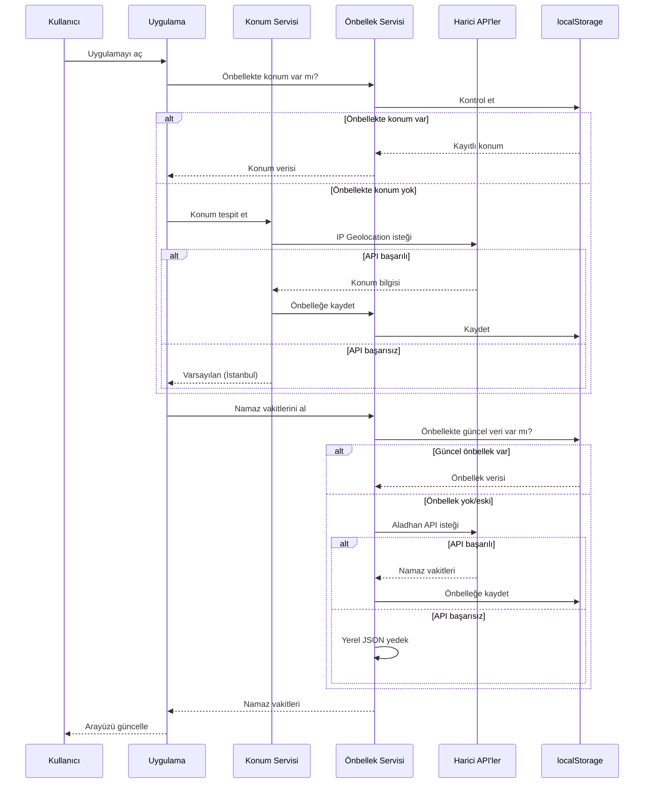
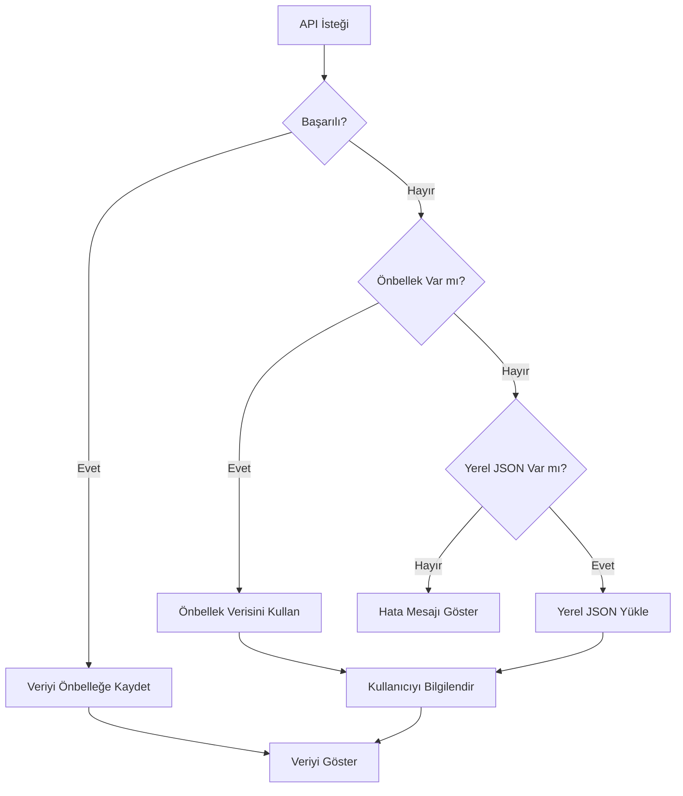

# Tasarım Dokümanı: Namaz ve Oruç Takip Uygulaması

## Genel Bakış

Bu uygulama, React + Vite ile geliştirilecek, tamamen istemci tarafında çalışan statik bir web uygulamasıdır. GitHub Pages üzerinde barındırılacak olup, harici API'ler aracılığıyla namaz vakitleri, oruç bilgileri, dini günler ve resmi tatilleri dinamik olarak gösterecektir. Uygulama, IP tabanlı konum tespiti, çoklu dil desteği, tema yönetimi ve kapsamlı bir önbellek/yedek sistemi içerecektir.

### Temel Tasarım Kararları

1. **React + Vite + TypeScript**: Tip güvenliği, hızlı geliştirme ve optimum derleme performansı
2. **Tailwind CSS**: Utility-first yaklaşımla hızlı ve tutarlı stil geliştirme, glassmorphism ve gradyan efektleri için ideal
3. **Zustand**: Hafif, basit state management (Redux'a göre çok daha az boilerplate)
4. **i18next**: Endüstri standardı çoklu dil desteği
5. **date-fns**: Hafif tarih işlemleri (Moment.js'e göre çok daha küçük bundle)
6. **Framer Motion**: Deklaratif animasyon API'si, React ile doğal entegrasyon

## Mimari

### Üst Düzey Mimari Diyagramı

```mermaid
graph TB
    subgraph "İstemci Tarafı Uygulama"
        App[App.tsx]
        
        subgraph "Sayfa Katmanı"
            Home[Ana Sayfa]
            Calendar[Takvim Sayfası]
        end
        
        subgraph "Bileşen Katmanı"
            PrayerCard[Namaz Vakitleri Kartı]
            FastingCard[Oruç Bilgi Kartı]
            CountdownTimer[Geri Sayım Sayacı]
            ReligiousDays[Dini Günler Kartı]
            HolidayCard[Tatil Kartı]
            LocationPicker[Konum Seçici]
            ThemeToggle[Tema Değiştirici]
            LangSwitch[Dil Değiştirici]
        end
        
        subgraph "Servis Katmanı"
            LocationService[Konum Servisi]
            PrayerService[Namaz API Servisi]
            CalendarService[Takvim Servisi]
            HolidayService[Tatil API Servisi]
            CacheService[Önbellek Servisi]
        end
        
        subgraph "State Yönetimi"
            LocationStore[Konum Store]
            PrayerStore[Namaz Store]
            SettingsStore[Ayarlar Store]
        end
        
        subgraph "Yardımcı Katman"
            HijriConverter[Hicri Dönüştürücü]
            DateUtils[Tarih Yardımcıları]
            i18n[Dil Dosyaları]
        end
    end
    
    subgraph "Harici API'ler"
        GeoAPI[IP Geolocation API]
        PrayerAPI[Aladhan Prayer Times API]
        HolidayAPI[Nager.Date Holiday API]
    end
    
    App --> Home
    App --> Calendar
    Home --> PrayerCard
    Home --> FastingCard
    Home --> CountdownTimer
    Home --> ReligiousDays
    Home --> HolidayCard
    
    PrayerCard --> PrayerService
    FastingCard --> PrayerService
    ReligiousDays --> CalendarService
    HolidayCard --> HolidayService
    LocationPicker --> LocationService
    
    PrayerService --> CacheService
    CalendarService --> CacheService
    HolidayService --> CacheService
    LocationService --> CacheService
    
    LocationService --> GeoAPI
    PrayerService --> PrayerAPI
    HolidayService --> HolidayAPI
    
    CacheService --> LocalStorage[(localStorage)]
end
```

### Veri Akış Diyagramı



## Bileşenler ve Arayüzler

### Proje Dizin Yapısı

```
src/
├── components/
│   ├── layout/
│   │   ├── Header.tsx
│   │   ├── Footer.tsx
│   │   └── Layout.tsx
│   ├── prayer/
│   │   ├── PrayerTimesCard.tsx
│   │   └── PrayerCountdown.tsx
│   ├── fasting/
│   │   ├── FastingInfoCard.tsx
│   │   └── FastingCountdown.tsx
│   ├── calendar/
│   │   ├── ReligiousDaysCard.tsx
│   │   ├── HolidayCard.tsx
│   │   └── CalendarView.tsx
│   ├── common/
│   │   ├── CountdownTimer.tsx
│   │   ├── Card.tsx
│   │   └── AnimatedNumber.tsx
│   └── settings/
│       ├── LocationPicker.tsx
│       ├── ThemeToggle.tsx
│       └── LanguageSwitch.tsx
├── services/
│   ├── locationService.ts
│   ├── prayerService.ts
│   ├── calendarService.ts
│   ├── holidayService.ts
│   └── cacheService.ts
├── stores/
│   ├── locationStore.ts
│   ├── prayerStore.ts
│   └── settingsStore.ts
├── utils/
│   ├── hijriConverter.ts
│   ├── dateUtils.ts
│   └── apiClient.ts
├── i18n/
│   ├── index.ts
│   ├── tr.json
│   └── en.json
├── data/
│   ├── fallbackPrayerTimes.json
│   ├── religiousDays.json
│   └── turkeyHolidays.json
├── types/
│   └── index.ts
├── hooks/
│   ├── usePrayerTimes.ts
│   ├── useCountdown.ts
│   └── useLocation.ts
├── App.tsx
├── main.tsx
└── index.css
```

### Bileşen Arayüzleri

#### Konum Servisi (`locationService.ts`)

```typescript
interface LocationData {
  country: string;
  countryCode: string;
  city: string;
  latitude: number;
  longitude: number;
  timezone: string;
}

interface LocationService {
  detectLocation(): Promise<LocationData>;
  searchCity(query: string): Promise<LocationData[]>;
  getDefaultLocation(): LocationData;
}
```

#### Namaz Servisi (`prayerService.ts`)

```typescript
interface PrayerTimes {
  fajr: string;      // İmsak
  sunrise: string;   // Güneş
  dhuhr: string;     // Öğle
  asr: string;       // İkindi
  maghrib: string;   // Akşam
  isha: string;      // Yatsı
  date: string;      // ISO tarih
}

interface PrayerService {
  getDailyPrayerTimes(lat: number, lng: number, date: Date): Promise<PrayerTimes>;
  getMonthlyPrayerTimes(lat: number, lng: number, month: number, year: number): Promise<PrayerTimes[]>;
  getNextPrayer(times: PrayerTimes): { name: string; time: string; remainingMs: number };
}
```

#### Takvim Servisi (`calendarService.ts`)

```typescript
interface HijriDate {
  day: number;
  month: number;
  monthName: string;
  year: number;
}

interface ReligiousDay {
  name: string;
  nameEn: string;
  hijriDate: HijriDate;
  gregorianDate: string;
  type: 'kandil' | 'bayram' | 'ozel';
  description?: string;
}

interface CalendarService {
  toHijri(date: Date): HijriDate;
  toGregorian(hijriDate: HijriDate): Date;
  getReligiousDays(year: number): ReligiousDay[];
  getUpcomingReligiousDays(count: number): ReligiousDay[];
  getRamadanInfo(year: number): { start: Date; end: Date; currentDay: number | null; isRamadan: boolean };
}
```

#### Tatil Servisi (`holidayService.ts`)

```typescript
interface Holiday {
  name: string;
  date: string;
  countryCode: string;
  type: 'national' | 'religious' | 'public';
}

interface HolidayService {
  getHolidays(countryCode: string, year: number): Promise<Holiday[]>;
  getTurkeyHolidays(year: number): Holiday[];
  getUpcomingHolidays(holidays: Holiday[], count: number): Holiday[];
}
```

#### Önbellek Servisi (`cacheService.ts`)

```typescript
interface CacheEntry<T> {
  data: T;
  timestamp: number;
  expiresAt: number;
}

interface CacheService {
  get<T>(key: string): T | null;
  set<T>(key: string, data: T, ttlMs: number): void;
  isValid(key: string): boolean;
  clear(key: string): void;
  clearAll(): void;
}
```

#### Hicri Dönüştürücü (`hijriConverter.ts`)

```typescript
interface HijriConverter {
  gregorianToHijri(date: Date): HijriDate;
  hijriToGregorian(hijriDate: HijriDate): Date;
  formatHijri(hijriDate: HijriDate, locale: string): string;
}
```

### Harici API Entegrasyonları

| API | Amaç | Endpoint | Yedek |
|-----|-------|----------|-------|
| ip-api.com | IP Geolocation | `http://ip-api.com/json/` | Varsayılan İstanbul |
| Aladhan API | Namaz Vakitleri | `https://api.aladhan.com/v1/timings/{date}` | Yerel JSON |
| Nager.Date | Resmi Tatiller | `https://date.nager.at/api/v3/PublicHolidays/{year}/{countryCode}` | Yerel JSON |

### State Yönetimi (Zustand Stores)

```typescript
// locationStore.ts
interface LocationState {
  location: LocationData | null;
  isLoading: boolean;
  error: string | null;
  setLocation: (location: LocationData) => void;
  detectLocation: () => Promise<void>;
}

// prayerStore.ts
interface PrayerState {
  todayTimes: PrayerTimes | null;
  nextPrayer: { name: string; time: string; remainingMs: number } | null;
  isLoading: boolean;
  dataSource: 'api' | 'cache' | 'fallback';
  fetchPrayerTimes: (lat: number, lng: number) => Promise<void>;
}

// settingsStore.ts
interface SettingsState {
  theme: 'dark' | 'light';
  language: 'tr' | 'en';
  toggleTheme: () => void;
  setLanguage: (lang: 'tr' | 'en') => void;
}
```

## Veri Modelleri

### Önbellek Veri Yapısı (localStorage)

```
localStorage keys:
├── "nt_location"      → CacheEntry<LocationData>
├── "nt_prayer_{date}" → CacheEntry<PrayerTimes>
├── "nt_holidays_{cc}_{year}" → CacheEntry<Holiday[]>
├── "nt_settings"      → { theme: string, language: string }
└── "nt_last_update"   → timestamp
```

### Yedek JSON Veri Yapısı

**`fallbackPrayerTimes.json`**: İstanbul için önceden hesaplanmış aylık namaz vakitleri
**`religiousDays.json`**: Yaklaşık 2-3 yıllık dini günler ve kandil tarihleri (Hicri → Miladi dönüşümlü)
**`turkeyHolidays.json`**: Türkiye'nin sabit ulusal bayramları

### Hicri Takvim Dönüşüm Algoritması

Uygulama, Hicri-Miladi dönüşümü için Kuwaiti algoritmasını kullanacaktır. Bu algoritma, astronomik hesaplamalar yerine tablo tabanlı bir yaklaşım kullanır ve istemci tarafında verimli çalışır.

```typescript
// Kuwaiti Algorithm - Hicri → Miladi dönüşüm
function hijriToGregorian(hYear: number, hMonth: number, hDay: number): Date {
  // Tablo tabanlı dönüşüm algoritması
  // Julian Day Number hesaplaması üzerinden
}

// Miladi → Hicri dönüşüm
function gregorianToHijri(date: Date): HijriDate {
  // Julian Day Number'dan Hicri tarihe dönüşüm
}
```

### Dini Günler Veri Modeli

Dini günler, Hicri takvim tarihlerine göre sabit olup her yıl Miladi karşılıkları hesaplanır:

| Dini Gün | Hicri Tarih |
|----------|-------------|
| Mevlid Kandili | 12 Rebiülevvel |
| Regaib Kandili | Recep ayının ilk Cuma gecesi |
| Mirac Kandili | 27 Recep |
| Berat Kandili | 15 Şaban |
| Ramazan Başlangıcı | 1 Ramazan |
| Kadir Gecesi | 27 Ramazan |
| Ramazan Bayramı | 1-3 Şevval |
| Kurban Bayramı | 10-13 Zilhicce |
| Hicri Yılbaşı | 1 Muharrem |


## Doğruluk Özellikleri

*Bir özellik (property), bir sistemin tüm geçerli yürütmelerinde doğru olması gereken bir davranış veya karakteristiktir. Özellikler, insan tarafından okunabilir spesifikasyonlar ile makine tarafından doğrulanabilir doğruluk garantileri arasında köprü görevi görür.*

Aşağıdaki özellikler, gereksinim dokümanındaki kabul kriterlerinden türetilmiştir. Her özellik, evrensel bir niceleyici ("Tüm ... için" veya "Herhangi bir ... için") içerir ve property-based testing ile doğrulanabilir.

### Özellik 1: Konum API Yanıt Parse Doğruluğu

*Herhangi bir* geçerli IP geolocation API yanıtı için, parse fonksiyonu ülke, şehir, enlem, boylam ve saat dilimi alanlarını içeren bir LocationData nesnesi döndürmelidir.

**Doğrular: Gereksinim 1.1**

### Özellik 2: Ayarlar localStorage Round-Trip

*Herhangi bir* geçerli ayar kombinasyonu (konum, tema, dil) için, ayarı localStorage'a kaydedip tekrar okuduğumuzda orijinal değerle eşdeğer bir sonuç elde etmeliyiz.

**Doğrular: Gereksinim 1.5, 7.4, 8.3**

### Özellik 3: Namaz Vakitleri Parse - Altı Vakit İnvariantı

*Herhangi bir* geçerli Aladhan API yanıtı için, parse fonksiyonu tam olarak 6 namaz vaktini (İmsak, Güneş, Öğle, İkindi, Akşam, Yatsı) içeren bir PrayerTimes nesnesi döndürmeli ve bu vakitler kronolojik sırada olmalıdır.

**Doğrular: Gereksinim 2.1**

### Özellik 4: Sonraki Vakit Hesaplama Doğruluğu

*Herhangi bir* geçerli PrayerTimes nesnesi ve mevcut zaman için, getNextPrayer fonksiyonu mevcut zamandan sonraki en yakın namaz vaktini döndürmelidir. Tüm vakitler geçmişse, ertesi günün ilk vaktini (İmsak) döndürmelidir.

**Doğrular: Gereksinim 2.2, 3.5**

### Özellik 5: Sahur/İftar Vakti Türetme

*Herhangi bir* geçerli PrayerTimes nesnesi için, sahur vakti İmsak (fajr) vaktine ve iftar vakti Akşam (maghrib) vaktine eşit olmalıdır.

**Doğrular: Gereksinim 3.1**

### Özellik 6: Ramazan Gün Hesaplama

*Herhangi bir* Ramazan ayı içindeki tarih için, Ramazan gün sayısı 1 ile 30 arasında olmalı ve kalan gün sayısı (30 - mevcut gün) formülüne uymalıdır. Ramazan dışındaki tarihler için, bir sonraki Ramazan'a kalan gün sayısı pozitif olmalıdır.

**Doğrular: Gereksinim 3.2, 3.4**

### Özellik 7: Hicri-Miladi Takvim Round-Trip

*Herhangi bir* geçerli Miladi tarih için, Miladi → Hicri → Miladi dönüşümü orijinal tarihi (±1 gün toleransla) vermelidir. Benzer şekilde, *herhangi bir* geçerli Hicri tarih için, Hicri → Miladi → Hicri dönüşümü orijinal tarihi vermelidir.

**Doğrular: Gereksinim 4.4**

### Özellik 8: Yaklaşan Etkinlik Sıralaması

*Herhangi bir* etkinlik listesi (dini günler veya tatiller) ve referans tarih için, getUpcoming fonksiyonu etkinlikleri tarihe göre artan sırada döndürmeli ve tüm döndürülen etkinliklerin tarihi referans tarihinden sonra olmalıdır.

**Doğrular: Gereksinim 4.3, 5.4**

### Özellik 9: Tatil API Parse Doğruluğu

*Herhangi bir* geçerli Nager.Date API yanıtı için, parse fonksiyonu her tatil için isim, tarih, ülke kodu ve tür alanlarını içeren Holiday nesneleri döndürmelidir.

**Doğrular: Gereksinim 5.1**

### Özellik 10: Türkiye Bayramları İnvariantı

*Herhangi bir* ülke kodu ve yıl kombinasyonu için, tatil listesi her zaman Türkiye'nin 4 ulusal bayramını (23 Nisan, 19 Mayıs, 30 Ağustos, 29 Ekim) içermelidir.

**Doğrular: Gereksinim 5.2**

### Özellik 11: Önbellek Servisi Round-Trip

*Herhangi bir* geçerli veri ve TTL değeri için, veriyi önbelleğe kaydedip TTL süresi dolmadan okuduğumuzda orijinal veriyle eşdeğer bir sonuç elde etmeliyiz. TTL süresi dolduktan sonra ise null döndürmelidir.

**Doğrular: Gereksinim 6.1**

### Özellik 12: API Hız Sınırlaması

*Herhangi bir* istek dizisi için, API istemcisi belirli bir zaman penceresi içinde maksimum istek sayısını aşmamalıdır. Sınır aşıldığında, istemci isteği geciktirmeli veya önbellekten yanıt vermelidir.

**Doğrular: Gereksinim 6.4**

### Özellik 13: Tema Toggle İdempotansı

*Herhangi bir* başlangıç tema durumu için, tema toggle fonksiyonunu iki kez çağırmak orijinal tema durumunu geri getirmelidir (dark → light → dark veya light → dark → light).

**Doğrular: Gereksinim 7.1**

### Özellik 14: Çeviri Anahtarları Tutarlılığı

*Herhangi bir* çeviri anahtarı için, hem Türkçe hem de İngilizce dil dosyasında karşılığı bulunmalıdır. Hiçbir anahtar boş string olmamalıdır.

**Doğrular: Gereksinim 8.2**

### Özellik 15: Tarayıcı Dili Tespiti

*Herhangi bir* navigator.language değeri için, dil tespit fonksiyonu desteklenen dillerden birini ('tr' veya 'en') döndürmelidir. Desteklenmeyen diller için varsayılan olarak 'tr' döndürmelidir.

**Doğrular: Gereksinim 8.4, 8.5**

## Hata Yönetimi

### Hata Katmanları



### Hata Senaryoları ve Çözümleri

| Senaryo | Çözüm | Kullanıcı Bildirimi |
|---------|--------|---------------------|
| IP Geolocation API başarısız | Varsayılan İstanbul konumu | "Konum tespit edilemedi, İstanbul kullanılıyor" |
| Namaz vakitleri API başarısız | localStorage önbellek → yerel JSON | "Veriler önbellekten yüklendi (son güncelleme: ...)" |
| Tatil API başarısız | Yerel Türkiye tatilleri JSON | "Tatil bilgileri yerel veriden yüklendi" |
| localStorage dolu/erişilemez | Sadece API verisi kullan, önbellek devre dışı | Sessiz hata, konsola log |
| Ağ bağlantısı yok | Tüm önbellek + yerel JSON | "Çevrimdışı mod - veriler son güncellemeye göre" |
| API rate limit aşıldı | Önbellek verisi kullan, yeniden deneme zamanlayıcısı | Sessiz, arka planda yeniden dene |

### Rate Limiting Stratejisi

```typescript
// Her API için ayrı rate limit konfigürasyonu
const RATE_LIMITS = {
  geolocation: { maxRequests: 5, windowMs: 60_000 },    // 5 istek/dakika
  prayerTimes: { maxRequests: 10, windowMs: 60_000 },   // 10 istek/dakika
  holidays: { maxRequests: 5, windowMs: 60_000 },       // 5 istek/dakika
};
```

## Test Stratejisi

### Genel Yaklaşım

Uygulama, iki tamamlayıcı test yaklaşımı kullanacaktır:

1. **Birim Testleri (Unit Tests)**: Belirli örnekler, edge case'ler ve hata durumları için
2. **Özellik Tabanlı Testler (Property-Based Tests)**: Evrensel özellikler için rastgele girdi üretimi ile

### Test Araçları

| Araç | Amaç |
|------|-------|
| Vitest | Test çalıştırıcı ve assertion kütüphanesi |
| fast-check | Property-based testing kütüphanesi |
| @testing-library/react | React bileşen testleri |
| msw (Mock Service Worker) | API mock'lama |

### Property-Based Test Konfigürasyonu

- Her property test minimum **100 iterasyon** çalıştırılacak
- Her test, tasarım dokümanındaki özellik numarasına referans verecek
- Etiket formatı: **Feature: namaz-oruc-takip, Property {numara}: {özellik_adı}**
- Her doğruluk özelliği TEK bir property-based test tarafından uygulanacak

### Test Kapsamı

#### Property-Based Testler (15 özellik)

| Özellik | Test Edilen Bileşen | Strateji |
|---------|---------------------|----------|
| Özellik 1 | locationService.parseResponse | Rastgele API yanıtları oluştur, parse sonucunu doğrula |
| Özellik 2 | settingsStore (konum/tema/dil) | Rastgele ayar kombinasyonları kaydet-oku |
| Özellik 3 | prayerService.parsePrayerTimes | Rastgele API yanıtları, 6 vakit ve kronolojik sıra kontrolü |
| Özellik 4 | prayerService.getNextPrayer | Rastgele vakitler ve zamanlar, doğru sonraki vakit |
| Özellik 5 | fastingModule.getSahurIftar | Rastgele PrayerTimes, sahur=fajr ve iftar=maghrib |
| Özellik 6 | calendarService.getRamadanInfo | Rastgele tarihler, gün sayısı aralık kontrolü |
| Özellik 7 | hijriConverter round-trip | Rastgele tarihler, dönüşüm round-trip |
| Özellik 8 | getUpcoming sıralama | Rastgele etkinlik listeleri, artan tarih sırası |
| Özellik 9 | holidayService.parseResponse | Rastgele API yanıtları, alan doğrulaması |
| Özellik 10 | holidayService.getHolidays | Rastgele ülke/yıl, Türkiye bayramları invariant |
| Özellik 11 | cacheService round-trip | Rastgele veri ve TTL, kaydet-oku-expire |
| Özellik 12 | apiClient rate limiting | Rastgele istek dizileri, sınır kontrolü |
| Özellik 13 | themeStore.toggleTheme | Rastgele başlangıç durumu, çift toggle = orijinal |
| Özellik 14 | i18n çeviri dosyaları | Tüm anahtarlar her iki dilde mevcut |
| Özellik 15 | languageDetection | Rastgele navigator.language değerleri, geçerli dil dönüşü |

#### Birim Testleri (Edge Case ve Örnekler)

- Konum tespiti başarısız → İstanbul varsayılanı (Gereksinim 1.4)
- API başarısız → önbellek fallback (Gereksinim 6.2)
- API + önbellek başarısız → yerel JSON fallback (Gereksinim 6.3)
- Desteklenmeyen tarayıcı dili → Türkçe varsayılanı (Gereksinim 8.5)
- Kandil listesi eksiksizliği (Gereksinim 4.1, 4.2)
- Dini bayramların tatil listesinde varlığı (Gereksinim 5.3)
- Yeni gün başlangıcında veri yenileme (Gereksinim 2.5)
